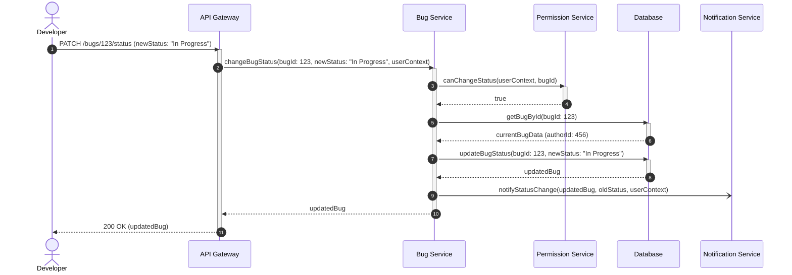

```mermaid
sequenceDiagram
    autonumber

    actor Dev as Developer
    participant BugTrackerAPI as API Gateway
    participant BugService as Bug Service
    participant PermissionService as Permission Service
    participant Database as Database
    participant NotificationService as Notification Service

    Dev ->> BugTrackerAPI: PATCH /bugs/123/status (newStatus: "In Progress")
    activate BugTrackerAPI

    BugTrackerAPI ->> BugService: changeBugStatus(bugId: 123, newStatus: "In Progress", userContext)
    activate BugService

    BugService ->> PermissionService: canChangeStatus(userContext, bugId)
    activate PermissionService
    PermissionService -->> BugService: true
    deactivate PermissionService

    BugService ->> Database: getBugById(bugId: 123)
    activate Database
    Database -->> BugService: currentBugData (authorId: 456)
    deactivate Database

    BugService ->> Database: updateBugStatus(bugId: 123, newStatus: "In Progress")
    activate Database
    Database -->> BugService: updatedBug
    deactivate Database

    BugService -) NotificationService: notifyStatusChange(updatedBug, oldStatus, userContext)
    
    BugService -->> BugTrackerAPI: updatedBug
    deactivate BugService

    BugTrackerAPI -->> Dev: 200 OK (updatedBug)
    deactivate BugTrackerAPI
```