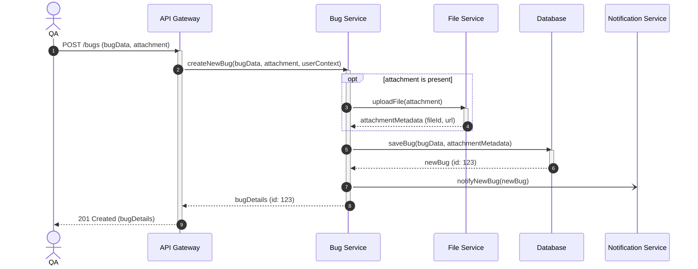

```mermaid
sequenceDiagram
    autonumber

    actor QA
    participant BugTrackerAPI as API Gateway
    participant BugService as Bug Service
    participant FileService as File Service
    participant Database as Database
    participant NotificationService as Notification Service

    QA ->> BugTrackerAPI: POST /bugs (bugData, attachment)
    activate BugTrackerAPI

    BugTrackerAPI ->> BugService: createNewBug(bugData, attachment, userContext)
    activate BugService

    opt attachment is present
        BugService ->> FileService: uploadFile(attachment)
        activate FileService
        FileService -->> BugService: attachmentMetadata (fileId, url)
        deactivate FileService
    end

    BugService ->> Database: saveBug(bugData, attachmentMetadata)
    activate Database
    Database -->> BugService: newBug (id: 123)
    deactivate Database

    BugService -) NotificationService: notifyNewBug(newBug)

    BugService -->> BugTrackerAPI: bugDetails (id: 123)
    deactivate BugService

    BugTrackerAPI -->> QA: 201 Created (bugDetails)
    deactivate BugTrackerAPI
```